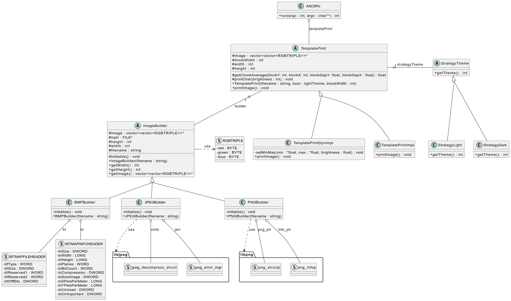
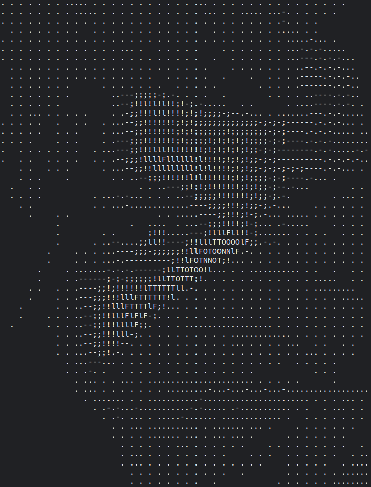
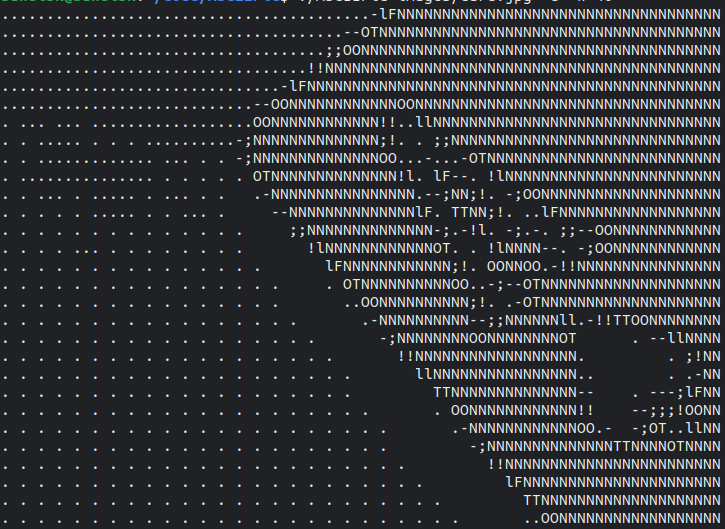
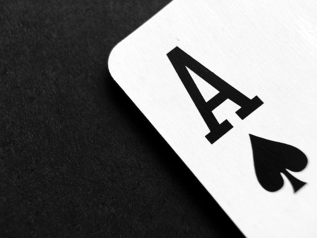

# ASCII Image Generator

Program to convert BMP, JPEG, and PNG images to ASCII art. Written in C++, uses libjpeg and libpng libraries. Supports light and dark variants for light and dark background. Can adjust brightness for low contrast images.

## Installation

1. Install the libjpeg and libpng libraries and their corresponding header files. On Ubuntu, you can do this by running: ```sudo apt-get install libjpeg-dev libpng-dev```
2. Clone the repository
3. Compile the program using ```make```

## Usage

./ASCIIPic FILE [-w width] [-d]  
Options:  
&emsp;```-w width```&emsp;Set the width of the ASCII image. Default is 60  
&emsp;```-d```&emsp;Prints the ASCII image with adjusted brightness  
&emsp;```-l```&emsp;Prints the ASCII image for light background  
&emsp;```-h```, ```--help```&emsp;Prints this help message  
Example:&emsp;```./ASCIIPic images/leaves.jpeg -w 40 -d```

Monospaced Fonts highly recommended

## Structure



## Examples

### images/leaves.jpeg



### images/card.jpg


